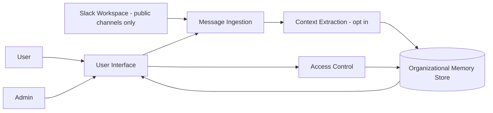

# System Block Diagram

The SUD system reads messages from Slack public channels only. Direct messages and private channels are excluded by default. Users can request onboarding summaries or ask questions through a chatbot or web interface. Context is saved only through an opt-in action initiated by the user. Approved context is stored in an organizational memory store and can be retrieved later. Users may delete context they saved, while admins may delete saved context from other users
