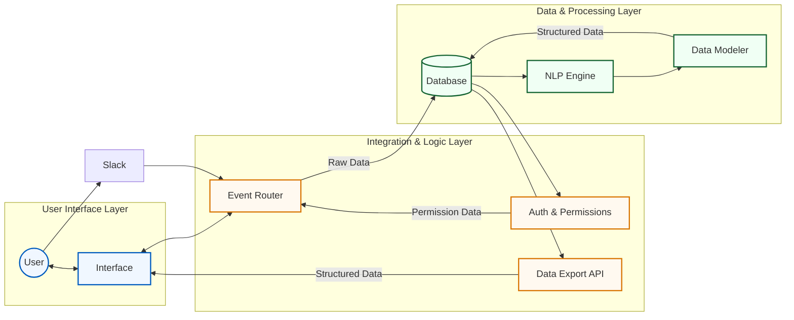

# System Block Diagram

```mermaid
flowchart LR
    classDef uiLayer fill:#f0f7ff,stroke:#005cbf,stroke-width:2px;
    classDef logicLayer fill:#fff9f0,stroke:#d97706,stroke-width:2px;
    classDef intelLayer fill:#f0fff4,stroke:#166534,stroke-width:2px;

    subgraph UI ["User Interface Layer"]
        direction TB
        User((User))
        BotInterface[Interface]
        %% ConsentMsg[Consent/Opt-in Prompt]
    end

    subgraph Logic ["Integration & Logic Layer"]
        direction TB
        EventRouter[Event Router]
        AuthModule[Auth & Permissions]
        DataExport[Data Export API]
    end

    subgraph Intelligence ["Data & Processing Layer"]
        direction TB
        NLP_Engine[NLP Engine]
        DataModeler[Data Modeler]
        DB[(Database)]
    end

    User <--> BotInterface
    BotInterface <--> EventRouter
    User --> Slack --> EventRouter
    
    AuthModule -- Permission Data--> EventRouter
    DB --> AuthModule
    %% AuthModule -.-> ConsentMsg
    %% ConsentMsg -.-> BotInterface
    
    EventRouter -- Raw Data --> DB
    DB --> NLP_Engine
    NLP_Engine --> DataModeler
    DataModeler -- Structured Data --> DB
    
    DB --> DataExport
    DataExport --Structured Data--> BotInterface

    class User,BotInterface,ConsentMsg uiLayer;
    class EventRouter,AuthModule,BoltApp,DataExport logicLayer;
    class NLP_Engine,DataModeler,DB intelLayer;
```
