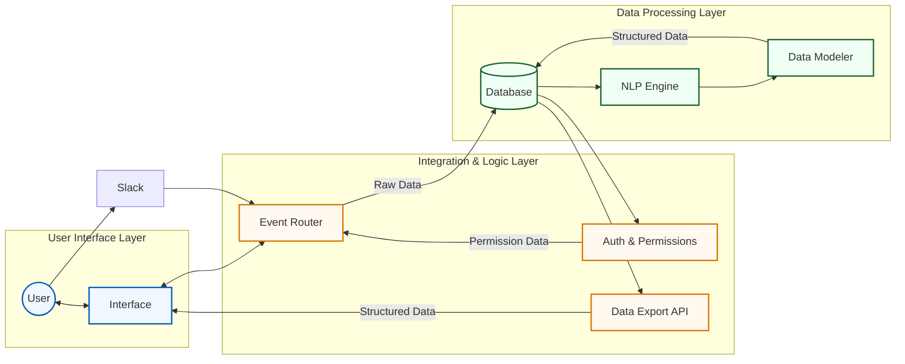

# System Block Diagram

```mermaid
flowchart LR
    classDef uiLayer fill:#f0f7ff,stroke:#005cbf,stroke-width:2px;
    classDef logicLayer fill:#fff9f0,stroke:#d97706,stroke-width:2px;
    classDef intelLayer fill:#f0fff4,stroke:#166534,stroke-width:2px;

    subgraph UI ["User Interface Layer"]
        direction TB
        User((User))
        BotInterface[Interface]
        %% ConsentMsg[Consent/Opt-in Prompt]
    end

    subgraph Logic ["Integration & Logic Layer"]
        direction TB
        EventRouter[Event Router]
        AuthModule[Auth & Permissions]
        DataExport[Data Export API]
    end

    subgraph Intelligence ["Data Processing Layer"]
        direction TB
        NLP_Engine[NLP Engine]
        DataModeler[Data Modeler]
        DB[(Database)]
    end

    User <--> BotInterface
    BotInterface <--> EventRouter
    User --> Slack --> EventRouter
    
    AuthModule -- Permission Data--> EventRouter
    DB --> AuthModule
    %% AuthModule -.-> ConsentMsg
    %% ConsentMsg -.-> BotInterface
    
    EventRouter -- Raw Data --> DB
    DB --> NLP_Engine
    NLP_Engine --> DataModeler
    DataModeler -- Structured Data --> DB
    
    DB --> DataExport
    DataExport --Structured Data--> BotInterface

    class User,BotInterface,ConsentMsg uiLayer;
    class EventRouter,AuthModule,BoltApp,DataExport logicLayer;
    class NLP_Engine,DataModeler,DB intelLayer;
```

This diagram visualizes the full stack application of SUD Bud and highlights the interactions between major components of the 3 main application layers: User Interface (UI), Integration/Logic, and Data/Processing. 

The ***User Interface Layer*** utilizes features of Slack Bots directly integrated into Slack's own UI, such as Home App displays, automated personal messaging through the bot, and built-in commands that can be used in any conversation the bot has access to. SUD Bud has a custom-designed dashboard within the Home App section of the app that allows access to all features of the project, including visualizing data, propting new structured data, and configuring privacy settings or unique administrative functionalities.

The ***Integration & Logic Layer*** manages calls to all features from the frontend UI through a custom implemented API. Events requesting changes to the database for primary features such as summarization/structuring are processed using an event router and sends the necessary payloads to the Data Processing Layer via common REST API paradigms. Similarly, any permission-related data is securely sent by the event router to Authorization & Permission components as managed by OAuth configurations. Success/error results from both types of requests are processed again by the event router and sent back to the frontend to be dynamically displayed for the user.

The ***Data Processing Layer*** contains multiple Google Gemini models levereging the Gemini API in Slack, which is configured to generate channel day summaries and user summaries based on customized prompts. The models structures its results into a standardized summary output schema and inputs it into a MongoDB cluster containing multiple databases for each channel in storage. 
**NOTE:** The use of databases specifically for individual channels in a specific workspace allow for consistent storage/retrieval of raw data for messages and members, which contain all information provided by the Slack API directly. *Each channel database manages the same types of collections: 2 store unstructured data (messages, members) and 2 store structured data (day summaries, user summaries).* View the [class diagrams](/docs/system-architecture/design.md) in System Architecture for more details on the database's fields and relations.