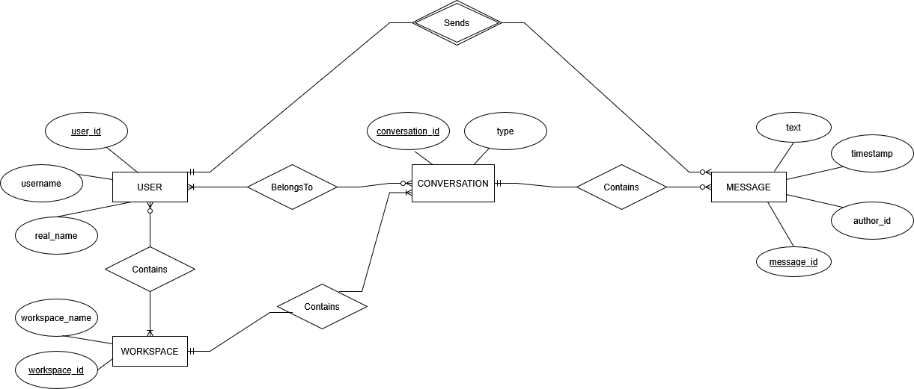
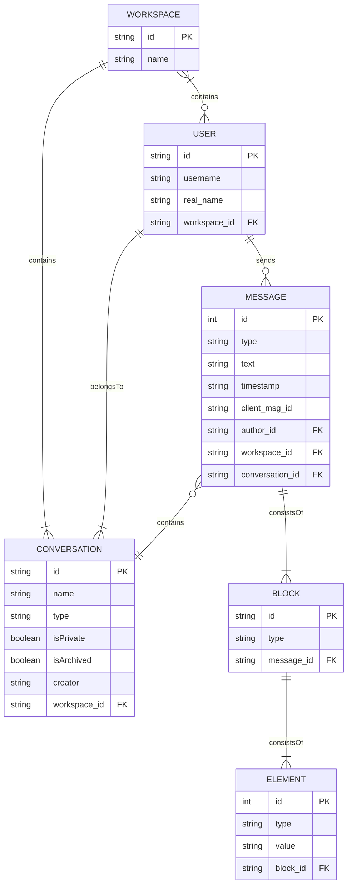

**Purpose**

The Design Document - Part I Architecture describes the software architecture and how the requirements are mapped into the design. This document will be a combination of diagrams and text that describes what the diagrams are showing.

**Overview**

For the scope of our project, our application's design will utilize the Slack API to access all user, message, and channel data, but development of a codebase compatible with multiple communication platforms is anticipated. For the best compatibility with the existing Web API that communication platforms generally provide, the application will integrate with the target platform using routes composed in JavaScript and Node.js; this version of the app specifically will leverege the Bolt for JavaScript open-source framework in the backend designed directly for Slack, allowing both the access of Slack data and interaction with Slack's UI. The tool's backend also will have the ability to extract context and structure data into meaningful units, accomplished through a custom built LLM or similar NLP model designed for organizing data based on learned language patterns. The tools used to implement this may shift as the project scope is fully defined, but possible services include the LangChain framework for Python or JavaScript or the LangExtract Python library. All instances of raw user and message data, as well as all the resulting strucutred conversation data will be placed in a persistent storage source such as MongoDB or NoSQL.

**Requirements**

In addition to the general requirements the Design Document - Part I Architecture will contain:

A description the different components and their interfaces. For example: client, server, database.

For each component provide class diagrams showing the classes to be developed (or used) and their relationship.

Sequence diagrams showing the data flow for _all_ use cases. One sequence diagram corresponds to one use case and different use cases should have different corresponding sequence diagrams.

Describe algorithms employed in your project, e.g. neural network paradigm, training and training data set, etc.

A check list for architecture design is attached here [architecture\_design\_checklist.pdf](https://templeu.instructure.com/courses/106563/files/16928870/download?wrap=1 "architecture_design_checklist.pdf")  and should be used as a guidance.

# Database Design

## Entity Relationship Diagram

## Raw Data Schema

### Workspace
Stores organizational data of an entire workspace
- id: string - primary key, also known as "team_id" or "team"
- name: string - name of the workspace

### Conversation
Stores data of all group objects in Slack, called conversations
- id: string - primary key
- name: string - name of the conversation
- type: string - marks type of conversation (channel, group, mpim)
- isPrivate: boolean - declares if conversation is private
- isArchived: boolean - declares if conversation is archived
- creator: string - id pointing to user that created the conversation
- workspace_id: string - foreign key (Workspace: id), contains relation to workspace

### User
Stores user data for specific member in a workspace
- id: string - primary key, also known as "user"
- username: string - displayed username of the user
- real_name: string - first and last name of the user
- workspace_id: string - foreign key (Workspace: id), contains relation to workspace

### Message
Stores data of a select message sent into a conversation
- id: int - primary key, assigned manually per conversation
- name: string - name of the conversation
- type: string - marks type of conversation (channel, group, mpim)
- text: string - string representation of message's text
- timestamp: string - string representation of timestamp the message was sent
- client_msg_id: uuid -  unique id for the message on the client side
- author_id: string - foreign key (User: id), contains relation to user that sent message
- workspace_id: string - foreign key (Workspace: id), contains relation to workspace
- conversation_id: string - foreign key (Conversation: id), contains relation to conversation where message is located

### Block
Collection of objects that make up a message
- id: string - primary key, also known as "block_id"
- type: string - type of block object (rich_text, etc.)
- message_id: string - foreign key (Message: id), contains relation to message the block makes up

### Element
Composed element/section of a message block
- id: int - primary key
- type: string - type of element (text, url)
- value: string - string representation of the item type associated with the text
- block_id: string - foreign key (Block: id), contains relation to block that the element belongs to