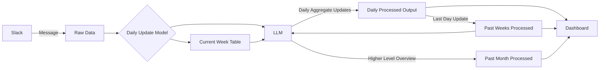
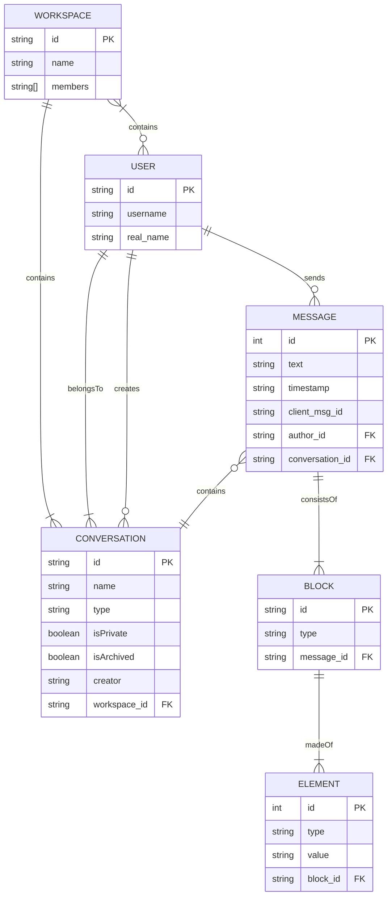
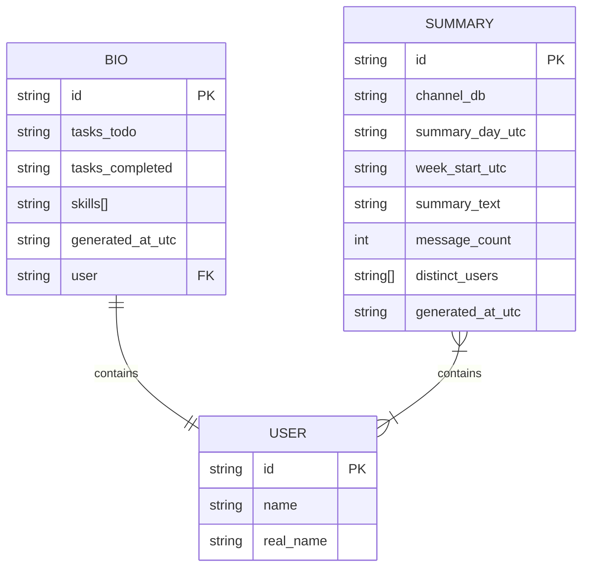

**Purpose**

The Design Document - Part I Architecture describes the software architecture and how the requirements are mapped into the design. This document will be a combination of diagrams and text that describes what the diagrams are showing.

**Overview**

For the scope of the SUD Bud project, our application's design will utilize the Slack API to access all user, message, and channel data, but development of a codebase compatible with multiple communication platforms is anticipated. For the best compatibility with the existing Web API that communication platforms generally provide, the application will integrate with the target platform using routes composed in JavaScript and Node.js; this version of the app specifically will leverege the Bolt for JavaScript open-source framework in the backend designed directly for Slack, allowing both the access of Slack data and interaction with Slack's UI. The tool's backend also will have the ability to extract context from conversations and structure data into daily summaries via a Google Gemini LLM. The Gemini model, configured through the Google GenAI SDK for Python, will be primarily prompt-engineered to convert message objects within specified time ranges into concise text summaries that identify key tasks, terms and user responsibilities. All instances of raw user and message data, as well as all the resulting strucutred conversation data will be placed in a MongoDB cluster as a persistent storage source. The application will directly address individual user privacy by designing settings that allow members to specify the extent they wish their messages to be collected for summaries within the Slack bot's UI. The app scales to process across multiple workspaces, meaning that the SUD Bud will be designed to manage and store different user, channel, and summary data from entirely seperate organizations.

**Requirements**

***TODO:***

In addition to the general requirements the Design Document - Part I Architecture will contain:

A description the different components and their interfaces. For example: client, server, database.

For each component provide class diagrams showing the classes to be developed (or used) and their relationship.

Sequence diagrams showing the data flow for _all_ use cases. One sequence diagram corresponds to one use case and different use cases should have different corresponding sequence diagrams.

Describe algorithms employed in your project, e.g. neural network paradigm, training and training data set, etc.

A check list for architecture design is attached here [architecture\_design\_checklist.pdf](https://templeu.instructure.com/courses/106563/files/16928870/download?wrap=1 "architecture_design_checklist.pdf")  and should be used as a guidance.

## Client-Server Workflow

```mermaid
graph LR
    Slack[Slack] -- Message --> RawData[Raw Data]
    RawData --> DUM{Daily Update Model}
    
    DUM --> LLM[LLM]
    DUM --> CWT[Current Week Table]
    CWT --> LLM
    
    LLM -- Daily Aggregate Updates --> DPO[Daily Processed Output]
    LLM -- Higher Level Overview --> PMP[Past Month Processed]
    
    DPO -- Last Day Update --> PWP[Past Weeks Processed]
    PWP --> LLM
    
    DPO --> Dashboard[Dashboard]
    PWP --> Dashboard
    PMP --> Dashboard

    %% Styling to match the original purple theme
    classDef purple fill:#f0f0ff,stroke:#9370db,color:#333;
    class Slack,RawData,DUM,CWT,LLM,DPO,PWP,PMP,Dashboard purple;
```
*Figure 1: Diagrame components of the complete Slack application workflow, from collection of sent messages/commands to structured summary output.*

### Daily Update Model
Model created from the raw data reflecting the relevant information for the day

### Current Week Table
A table of the previous daily models to keep context for LLM

### Daily Processed Output
Each day the LLM will process our data models and produce strcutred summarizations for the dashboard

### Past Weeks Processed
An archieve of the final daily output for each week

### Past Month Processed
Overviews of each month based on the LLM processing the Past Weeks Processed table

# Database Design

## Raw Data Schema

```mermaid
erDiagram
    WORKSPACE }|--o{ USER : contains
    WORKSPACE ||--|{ CONVERSATION : contains

    USER ||--|{ CONVERSATION : belongsTo
    USER ||--o{ CONVERSATION : creates
    USER ||--o{ MESSAGE : sends

    MESSAGE }o--|| CONVERSATION : contains
    MESSAGE ||--|{ BLOCK : consistsOf
    BLOCK ||--|{ ELEMENT : madeOf

    WORKSPACE {
        string id PK
        string name
        string[] members
    }
    USER {
        string id PK
        string username
        string real_name
    }
    CONVERSATION {
        string id PK
        string name
        string type
        boolean isPrivate
        boolean isArchived
        string creator
        string workspace_id FK
    }
    MESSAGE {
        int id PK
        string text
        string timestamp
        string client_msg_id
        string author_id FK
        string conversation_id FK
        
    }
    BLOCK {
        string id PK
        string type
        string message_id FK
    }
    ELEMENT {
        int id PK
        string type
        string value
        string block_id FK
    }
```
*Figure 2: ER Diagram of relations between Slack data objects collected directly from Slack API*

### Workspace
Stores organizational data of an entire workspace
- id: string - primary key, also known as "team_id" or "team"
- name: string - name of the workspace
- members: string[] - array of user IDs referencing all members of the workspace

### Conversation
Stores data of all group objects in Slack, called conversations
- id: string - primary key
- type: string - marks type of conversation (channel, group, mpim)
- isPrivate: boolean - declares if conversation is private
- isArchived: boolean - declares if conversation is archived
- creator: string - id pointing to user that created the conversation
- workspace_id: string - foreign key (Workspace: id), contains relation to workspace

### User
Stores user data for specific member in a workspace
- id: string - primary key, also known as "user"
- username: string - displayed username of the user
- real_name: string - first and last name of the user

### Message
Stores data of a select message sent into a conversation
- id: int - primary key, unique identifier assigned manually per message in a conversation
- text: string - string representation of message's text
- timestamp: bigint - UNIX representation of timestamp the message was sent, derived from original string provided by Slack API (ex, `"1512104434.000490"`)
- client_msg_id: uuid -  unique id for the message on the client side
- author_id: string - foreign key (User: id), contains relation to user that sent message
- conversation_id: string - foreign key (Conversation: id), contains relation to conversation where message is located

### Block
Collection of objects that compose a message's contents. This can include plain text, rich text, images, files, and other components of a message.
- id: string - primary key, also known as "block_id"
- type: string - type of block object (rich_text, etc.)
- message_id: string - foreign key (Message: id), contains relation to message the block makes up

### Element
Composed element/section that makes up a message block. This can include a URL associated with an attachment, text representing a markdown file, etc.
- id: int - primary key
- type: string - type of element (text, url)
- value: string - string representation of the item type associated with the text
- block_id: string - foreign key (Block: id), contains relation to block that the element belongs to

## Structured Data Schema

```mermaid
erDiagram
    BIO ||--|| USER : contains
    SUMMARY }|--|{ USER : contains

    BIO {
        string id PK
        string tasks_todo
        string tasks_completed
        string skills[]
        string generated_at_utc
        string user FK
    }

    SUMMARY {
        string id PK
        string channel_db
        string summary_day_utc
        string week_start_utc
        string summary_text
        int message_count
        string[] distinct_users
        string generated_at_utc
    }

    USER {
        string id PK
        string name
        string real_name
    }
```
*Figure 3: ER Diagram of structured message data from the LLM model, which includes a daily task summary and user bio*

### Bio
Collection of structuring model's outputs of holistic user summaries; includes data from all channels & workspaces user is a member of
- id: string - primary key
- tasks_todo: string - Structured summary of upcoming tasks and projects the user is a part of / mentions they will be working on.
- tasks_completed: string - Structured summary of major tasks and projects the user mentions they have finished.
- skills: string[] - Structured array of skills and topics the user has experience in, based on their assigned projects & completed tasks.
- generated_at_utc: string - representation of UTC timestamp for date of summary generation (ex, `2026-04-05T00:00:00Z`)
- user: string - foreign key (User: id), contains relation to member_id assigned to a specific user

### Summary
Collection of structuring model's outputs of daily message summaries
- id: string - primary key
- channel_db: string - unique database name for channel on MongoDB, created by combining channel name & ID (ex, `general_channel_C12345ABCDE`)
- summary_day_utc: string - representation of UTC timestamp for selected day of summary
- week_start_utc: string - representation of UTC timestamp for starting week of summary (Sundays)
- summary_text: string - prompt result for structured data from Gemini model
- message_count: int - number of messages sent on selected summary day
- distinct_users: string[] - collection of member_ids representing users that sent messages on selected summary day
- generated_at_utc: string - representation of UTC timestamp for date of summary generation (ex, `2026-04-05T00:00:00Z`)