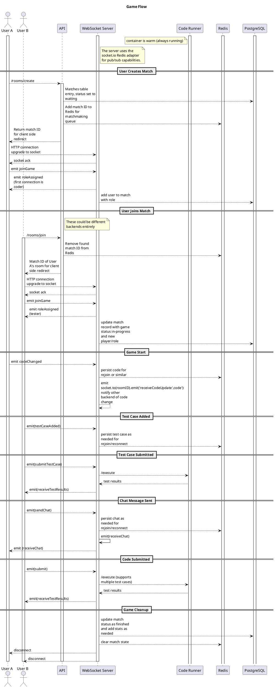

# Sequence Diagrams

## Use Case 1 (Full Game Flow with Redis/websockets)

## Use Case 2 (Default Matchmaking)

## Use Case 3 (Party Matchmaking)

## Use Case 4 (Account Creation)

## Use Case 5 (Signing In)

