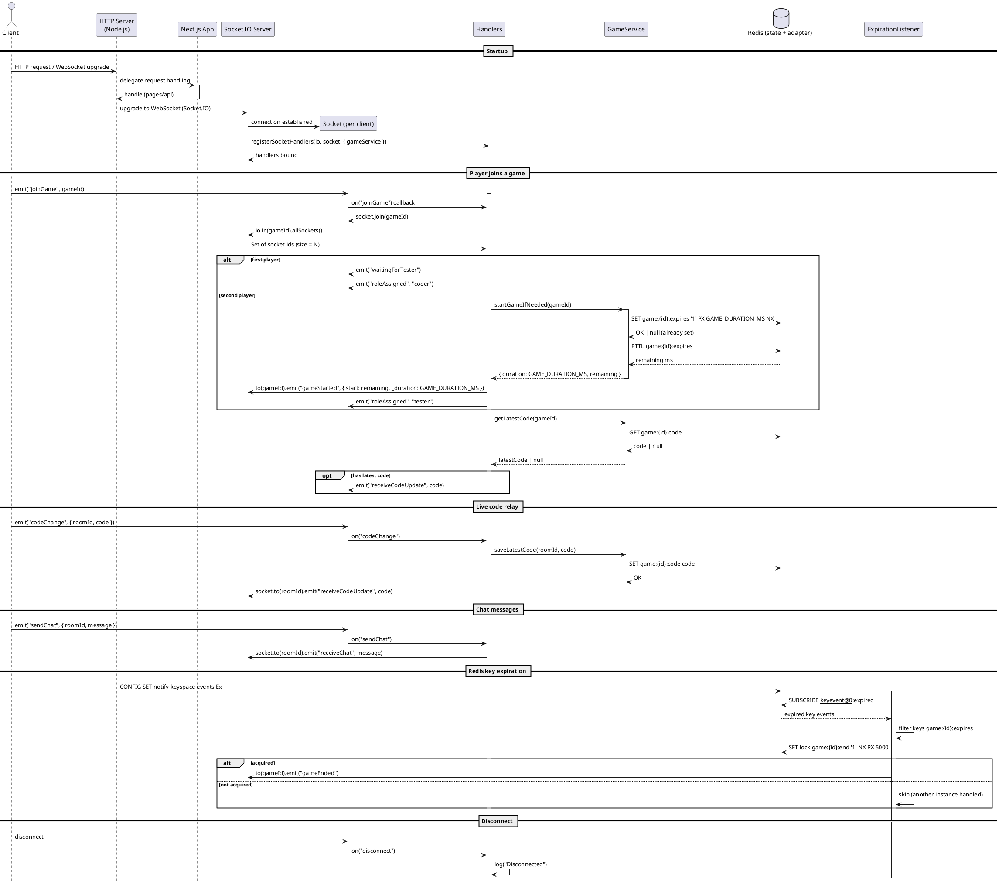

```plantuml-diagram
@startuml
' Code BattleGrounds - Server Sequence Diagram
' Shows flow when the server receives socket signals and timer interactions

skinparam linetype polyline
hide footbox

actor Client
participant "HTTP Server\n(Node.js)" as Http
participant "Next.js App" as Next
participant "Socket.IO Server" as IO
participant "Socket (per client)" as Sock
participant "Handlers" as H
participant "GameService" as GS
database "Redis (state + adapter)" as R
participant "ExpirationListener" as EL

== Startup ==
Client -> Http : HTTP request / WebSocket upgrade
Http -> Next : delegate request handling
activate Next
Next --> Http : handle (pages/api)
deactivate Next

Http -> IO : upgrade to WebSocket (Socket.IO)
create Sock
IO -> Sock : connection established
IO -> H : registerSocketHandlers(io, socket, { gameService })
H --> IO : handlers bound

== Player joins a game ==
Client -> Sock : emit("joinGame", gameId)
activate H
Sock -> H : on("joinGame") callback
H -> Sock : socket.join(gameId)
H -> IO : io.in(gameId).allSockets()
IO --> H : Set of socket ids (size = N)
alt first player
  H -> Sock : emit("waitingForTester")
  H -> Sock : emit("roleAssigned", "coder")
else second player
  H -> GS : startGameIfNeeded(gameId)
  activate GS
  GS -> R : SET game:{id}:expires '1' PX GAME_DURATION_MS NX
  R --> GS : OK | null (already set)
  GS -> R : PTTL game:{id}:expires
  R --> GS : remaining ms
  GS --> H : { duration: GAME_DURATION_MS, remaining }
  deactivate GS
  H -> IO : to(gameId).emit("gameStarted", { start: remaining, _duration: GAME_DURATION_MS })
  H -> Sock : emit("roleAssigned", "tester")
end

H -> GS : getLatestCode(gameId)
GS -> R : GET game:{id}:code
R --> GS : code | null
GS --> H : latestCode | null
opt has latest code
  H -> Sock : emit("receiveCodeUpdate", code)
end

== Live code relay ==
Client -> Sock : emit("codeChange", { roomId, code })
Sock -> H : on("codeChange")
H -> GS : saveLatestCode(roomId, code)
GS -> R : SET game:{id}:code code
R --> GS : OK
H -> IO : socket.to(roomId).emit("receiveCodeUpdate", code)

== Chat messages ==
Client -> Sock : emit("sendChat", { roomId, message })
Sock -> H : on("sendChat")
H -> IO : socket.to(roomId).emit("receiveChat", message)

== Redis key expiration ==
Http -> R : CONFIG SET notify-keyspace-events Ex
activate EL
EL -> R : SUBSCRIBE __keyevent@0__:expired
R --> EL : expired key events
EL -> EL : filter keys game:{id}:expires
EL -> R : SET lock:game:{id}:end '1' NX PX 5000
alt acquired
  EL -> IO : to(gameId).emit("gameEnded")
else not acquired
  EL -> EL : skip (another instance handled)
end

== Disconnect ==
Client -> Sock : disconnect
Sock -> H : on("disconnect")
H -> H : log("Disconnected")

@enduml
```