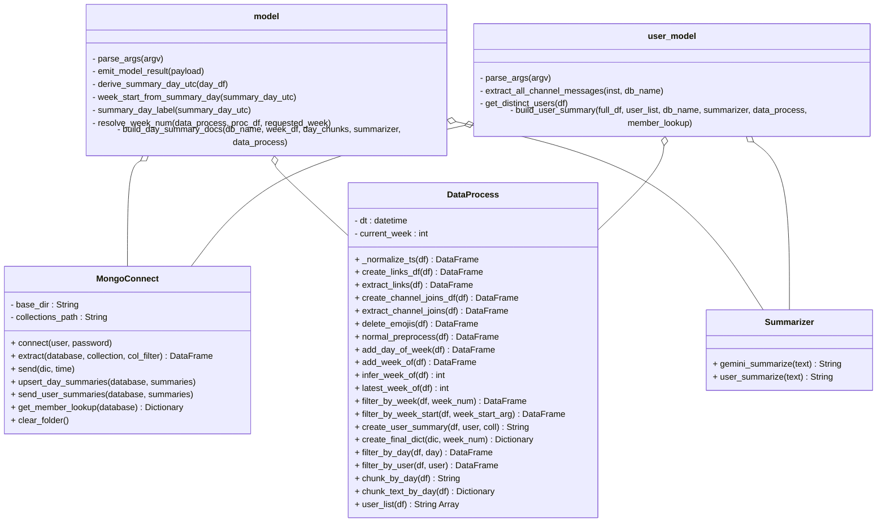

**Purpose**

This document describes the Python backend architecture of the SUD Bud application, including all classes, scripts, and their relationships. It covers how raw Slack data is extracted, preprocessed, summarized via an LLM, and stored back into MongoDB.

**Overview**

The Python backend is composed of three core classes — `MongoConnect`, `DataProcess`, and `Summarizer` — and two entry point scripts, `model.py` and `user_model.py`. Together, they form a pipeline that extracts raw Slack messages from MongoDB, cleans and structures the data, generates concise summaries using Google Gemini, and persists the results back to the database for use by the dashboard.

## Architecture Diagram

*Figure 1: UML class diagram of the Python backend showing all classes, their attributes and methods, and their dependencies from the entry point scripts.*

## Components

### MongoConnect

Handles all interactions with the MongoDB cluster — establishing connections, reading raw data, and writing processed results.

| Function | Description |
|---|---|
| `connect(user, password)` | Establishes a connection to the MongoDB cluster using a URI template, pings the deployment to verify the connection, and returns the client object. |
| `extract(database, collection, col_filter)` | Connects to a specified database and collection, pulls all documents into a list (stripping `_id`), converts them to a DataFrame, and returns only the columns specified in `col_filter`. |
| `send(dic, time)` | Takes a dictionary mapping database names to DataFrames, drops any existing databases with the same timestamped name, then re-creates them by splitting each DataFrame by `day` and inserting each day's records into its own collection. |
| `upsert_day_summaries(database, summaries)` | Writes daily summary documents to a `summaries` collection, first deleting any existing entry for the same `summary_day_utc` value to avoid duplicates, then inserting the new one. Returns the count of successfully inserted summaries. |
| `send_user_summaries(database, summaries)` | Clears the entire `user_summaries` collection and replaces it with a fresh batch of summary documents. Returns the count of inserted documents. |
| `get_member_lookup(database)` | Queries the `members` collection and returns a dictionary mapping each `member_id` to its corresponding `real_name`. |
| `clear_folder()` | Deletes all files in the local `collections` folder and returns `1` on completion. |

### DataProcess

Handles all preprocessing, filtering, and structuring of raw Slack message DataFrames before they are passed to the summarizer.

| Function | Description |
|---|---|
| `_normalize_ts(df)` | Internal helper that converts the `ts` column from Slack's string epoch format into proper pandas datetime objects. |
| `create_links_df(df)` | Returns a filtered DataFrame containing only rows where the message text contains a URL. |
| `extract_links(df)` | Returns a filtered DataFrame with URL-containing rows removed (inverse of `create_links_df`). |
| `create_channel_joins_df(df)` | Returns a filtered DataFrame containing only rows where a user joined the channel. |
| `extract_channel_joins(df)` | Returns a filtered DataFrame with channel-join messages removed (inverse of `create_channel_joins_df`). |
| `delete_emojis(df)` | Strips Slack-style emoji tokens (e.g. `:thumbsup:`) from the `text` column using regex. |
| `normal_preprocess(df)` | Runs the full standard cleaning pipeline: removes channel joins, links, and emojis, then appends day-of-week and week-number columns. |
| `add_day_of_week(df)` | Normalizes timestamps and adds a `day_name` column (e.g. "Monday"). |
| `add_week_of(df)` | Normalizes timestamps and adds a `week_of` column containing the integer week number of the year. |
| `infer_week_of(df)` | Returns the most common week number found in a DataFrame, useful when a slice spans multiple weeks. |
| `latest_week_of(df)` | Returns the maximum (most recent) week number found in a DataFrame. |
| `filter_by_week(df, week_num)` | Filters a DataFrame to only rows matching a specific week number, defaulting to the current week. |
| `filter_by_week_start(df, week_start_arg)` | Filters a DataFrame to the 7-day window (Sunday–Saturday) that contains a given ISO timestamp string. |
| `create_user_summary(df, user, coll)` | Joins all of a user's messages into one string and passes it to the Gemini LLM via the `Summarizer` class, returning the summary text. |
| `create_final_dict(dic, week_num)` | Iterates over a dictionary of DataFrames, filters to the target week, then generates per-user per-day summaries, returning a new dictionary of summarized DataFrames. |
| `filter_by_day(df, day)` | Filters a DataFrame to only rows matching a specific day name. |
| `filter_by_user(df, user)` | Filters a DataFrame to only rows from a specific user. |
| `chunk_by_day(df)` | Combines all messages into a single string organized by day with labeled day separators, returning one large text block. |
| `chunk_text_by_day(df)` | Returns a dictionary mapping each day name to its concatenated message text, sorted by calendar order. |
| `user_list(df)` | Returns an array of unique user IDs present in the DataFrame. |

### Summarizer

Wraps the Google Gemini 2.5 Flash API to generate structured text summaries from Slack message content. Both methods use a low temperature (0.3) for consistent, reproducible output.

| Function | Description |
|---|---|
| `gemini_summarize(text)` | Sends a block of text to Gemini to generate a **daily channel summary**. The system prompt enforces a two-section format (*Main tasks*, *Completed tasks*) with up to three bullet points each. Returns the summary string, or a fallback error message on failure. |
| `user_summarize(text)` | Sends a block of text to Gemini to generate a **per-user summary**. The system prompt enforces a three-section format (*To-do*, *Skills*, *Completed tasks*). The Skills section extracts short keyword/phrase bullets reflecting the user's areas of work. Returns the summary string, or a fallback error message on failure. |

`gemini_summarize` is designed for summarizing a channel's daily activity, while `user_summarize` is tailored to profiling an individual user's contributions and skills across their messages.

### model.py

Entry point script for generating and storing **day-level channel summaries**. Invoked from the command line or Node.js backend with a target channel database name and optional week arguments.

| `emit_model_result(payload)` | Prints a structured JSON result to stdout with a special prefix (`__MODEL_RESULT__`), allowing the Node.js backend to parse the output programmatically. |
| `parse_args(argv)` | Parses CLI arguments to extract the database name, an optional `--week` number, and an optional `--week-start` ISO date string. Returns all three with sensible defaults. |
| `derive_summary_day_utc(day_df)` | Takes a day's DataFrame, finds the earliest timestamp, and returns it as a UTC ISO string representing midnight of that day (e.g. `2026-04-05T00:00:00Z`). |
| `week_start_from_summary_day(summary_day_utc)` | Given a UTC day string, calculates and returns the UTC ISO string for the preceding Sunday — the start of that calendar week. |
| `summary_day_label(summary_day_utc)` | Converts a UTC ISO date string into a human-readable day name like "Monday", used for console output labeling. |
| `resolve_week_num(data_process, proc_df, requested_week)` | Determines which week number to process — checking the requested week first, then falling back to the latest week in the data, then inferring from the most common week present. |
| `build_day_summary_docs(db_name, week_df, day_chunks, summarizer, data_process)` | Iterates over each day's text chunks, calls the Gemini summarizer, and assembles a list of structured summary documents containing the channel name, UTC timestamps, summary text, message count, distinct users, and generation time. |

**Script flow:** Parses args → connects to MongoDB → extracts and validates messages → preprocesses → filters to target week → chunks by day → generates summaries → saves to MongoDB → emits JSON result to stdout.

### user_model.py

Entry point script for generating and storing **per-user summaries** across all historical messages in a channel. Invoked from the command line or Node.js backend with a target channel database name.

| `parse_args(argv)` | Parses CLI arguments and returns the database name. Ignores any flag-style `--` arguments. |
| `extract_all_channel_messages(inst, db_name)` | Extracts raw messages from MongoDB, validates that required columns are present, filters to rows where `type == 'message'`, and drops rows missing a user or text value. |
| `get_distinct_users(df)` | Returns a deduplicated list of non-empty user ID strings found in the DataFrame's `user` column. |
| `build_user_summary(full_df, user_list, db_name, summarizer, data_process, member_lookup)` | Iterates over each user, filters all of their messages across all time, joins the text into one string, calls Gemini's `user_summarize`, and assembles a list of summary documents containing user ID, real name, message count, summary text, and generation timestamp. |

**Script flow:** Parses args → connects to MongoDB → extracts and cleans messages → preprocesses → retrieves distinct users and member ID-to-name lookup → generates a Gemini summary per user → prints to console → saves all summaries to MongoDB.