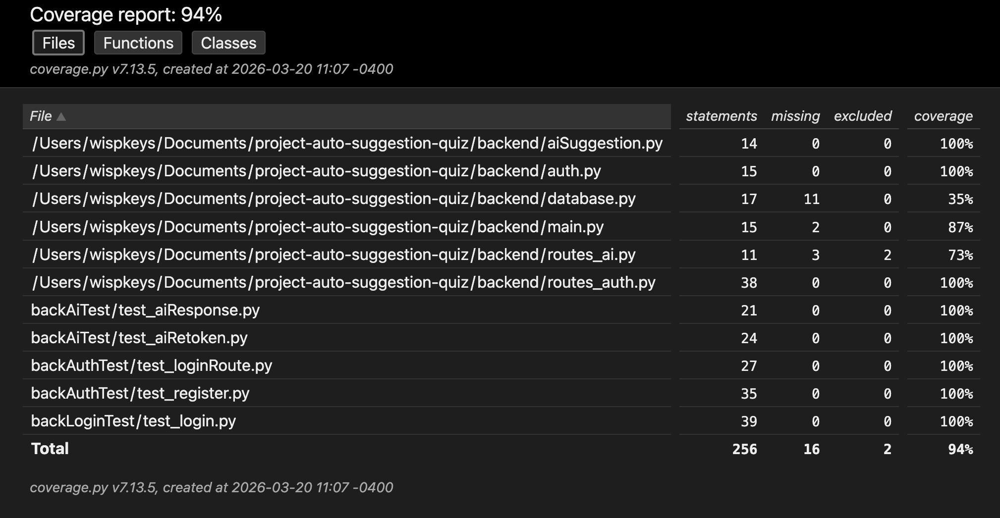

# Backend Unit Testing

<details>
<summary>Backend Coverage Report</summary>



</details>

# Views

# backAiTest
def test_aiResponse():
```
Test: Checks to see if AI is able to create a response to the user and properly respond.
Returns: An suggestion successfully given that the response is not 'none' and '>0'.
```
def test_aiRetoken():
```
Test: Checks to see if AI is able to retoken it's response after minor synatx error. (Ex: Improper ;)
Returns: AI is able to properly retoken it's bad response to the good response and is able to send the good response instead.
```
# backAuthTest
def test_loginRoute_success():
```
Test: Checks to see if the mock database is able to accept the login credentials and is able to route the login.
Returns: Successful and logs the user in with a status of 200, meaning the route has been successful.
```
def test_loginRoute_wrong_password():
```
Test: Insert a wrong credential to the database that can correctly route the credentials, but also recognize that the mock credentials are incorrect to log in
Returns: A successful fail from the testing, that the credentials are false, and a status has been confirmed.
```
def test_register_success():
```
Test: Student should be able to register their register into the database, and the database should be able to recognize new credentials
Returns: Success due to the database being able to read the new credentials that the student has inputted to the database. An assertion checks that 200 has gone through, meaning success.
```
def test_register_email_already_exists():
```
Test: Student should be denied ability to register if the database has detected an pre-existing email.
Returns: Error 400, issue on the user end where they cannot use that email.
```
def test_register_invalid_role():
```
Test: User attempts to register with a role that does not exist.
Returns: Error 400, issue on the user end where the role they are trying to achieve does not exist, and is not granted registration to the website.
```
# backLoginTest
def test_login_success():
```
Test:User enters correct credentials that is pre-existing in the database
Returns: Accepted into the website from database due to a match.
```
def test_login_wrong_password():
```
Test: User enters an incorrect credential with no match in the database
Returns: Not accepted into the website, unable to verify the existing credentials
```
def test_login_user_not_found():
```
Test: Use enters a user that does not exist in the database
Returns: Not accepted, no match and unable to verify the existing username.
```
